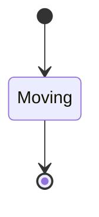
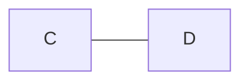

Example Mermaid diagram

```mermaid
graph TD;
    A-->B;
    A-->C;
    B-->D;
    C-->D;
```

```mermaid
stateDiagram
    [*]-->Moving
    Moving-->[*]
```

```mermaid
flowchart LR
    C---D

    %% style C fill:#f9f
    %% style D fill:#bbf
```

import Mermaid from '@theme/Mermaid';

<Mermaid
  value={`graph TD;
    A-->B;
    A-->C;
    B-->D;
    C-->D;`}
/>